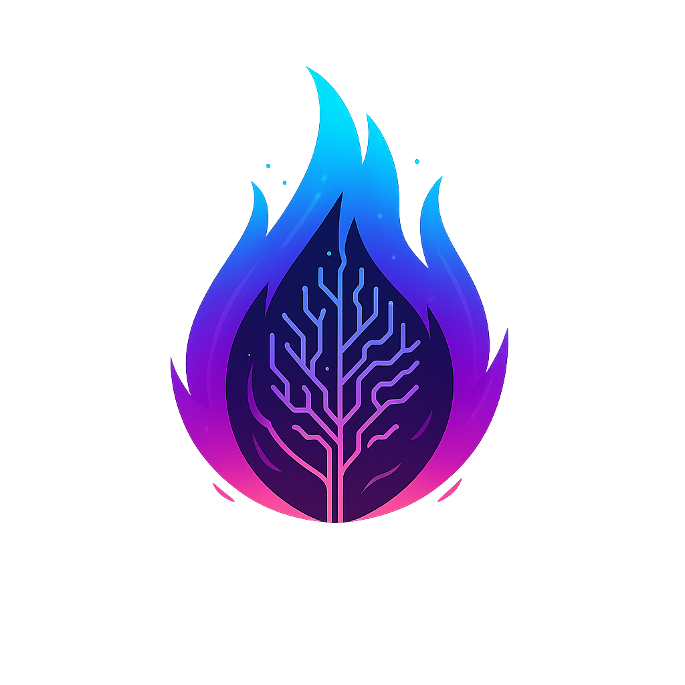
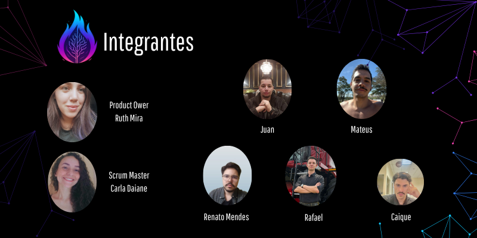

# ATHOS
### 5° Semestre Banco de Dados

  <a href ="#busts_in_silhouette-integrantes-da-equipe">  Integrantes da Equipe </a> •
  <a href ="#pushpin-projeto-api">  Projeto API </a> •
  <a href="#white_check_mark-requisitos">  Requisitos </a> •
  <a href="#card_file_box-backlog-do-produto"> Backlog do Produto </a> •
  <a href="#calendar-backlog-das-sprints"> Backlog das Sprints </a> •
  <a href="#hourglass_flowing_sand-cronograma-da-api"> Cronograma da API </a>
  <a href="#computer-tecnologias-utilizadas"> Tecnologias Utilizadas </a> •
  <a href="#gear-estrutura-do-projeto"> Estrutura do Projeto </a> •
  <a href="#gear-manual-de-instalacao"> Manual de Instalação </a> •
  <a href="#gear-documentacoes"> Documentações </a> •

---

<h1 id="busts_in_silhouette-integrantes-da-equipe">👥 Integrantes da Equipe</h1>

| Integrantes | Redes Sociais |
|-------------|---------------|
| Ruth Mira - Product Owner |   |
| Carla Daiane - Developer  |   |
| Caique - Developer |   |
| Juan  - Developer |   |
| Mateus Soares  - Developer |   |
| Rafael Trevizoli - Developer |   |
| Renato Mendes - Developer |   |

---

<h1 id="pushpin-projeto-api">📌 Projeto API</h1> 

### **Desafio**

O desafio consiste em desenvolver uma ferramenta analítica para gestão de projetos. A ferramenta deve consumir dados de um sistema de gestão via API, consolidar essas informações em um **Data Warehouse** e, a partir daí, gerar indicadores, dashboards e boards que permitam acompanhar o andamento dos projetos. A aplicação deve oferecer diferentes perfis de usuário, com níveis de permissão distintos.

### **Solução (ATHOS INSIGHT)**

O ATHOS INSIGHT será uma ferramenta que irá consumir dados diretamente de um sistema de gestão de projetos. Esses dados serão organizados em um **Data Warehouse**, que servirá como base para a criação de relatórios, dashboards e indicadores de desempenho. A plataforma permitirá que a equipe de gestão acompanhe o cronograma, os custos e a resolução de bugs, facilitando a tomada de decisões estratégicas e garantindo que os projetos sejam concluídos dentro do prazo e do orçamento. O sistema contará com diferentes níveis de acesso, assegurando a segurança e a privacidade das informações.

<h1 id="white_check_mark-requisitos">✅ Requisitos</h1> 

  
⚙️ Requisitos Funcionais

| ID | Requisito |
| :--- | :--- |
| **RF01** | O sistema deve estabelecer e manter uma conexão contínua com a API do Jira Cloud para coletar dados de projetos, módulos, atividades, status e tempo. A integração deve usar tokens de acesso para segurança e continuar operando com os dados mais recentes em caso de falha na API. |
| **RF02** | Na ausência de acesso à API do Jira, o sistema deve processar documentos externos (PDF e CSV) fornecidos pelo cliente para gerar relatórios com dados de contingência, garantindo a continuidade do serviço. |
| **RF03** | O sistema deve armazenar e permitir a visualização de dados históricos por períodos superiores a um ano, com filtros flexíveis de tempo (mês, ano, etc.) para análise comparativa e de tendências. |
| **RF04** | O sistema deve incluir um módulo de gestão de usuários que permita a criação, edição e exclusão de perfis. Serão definidos três perfis distintos (Gerente de Projetos, Líder de Equipe e Membro da Equipe) com permissões segregadas para garantir que cada usuário acesse apenas as informações e funcionalidades para as quais está autorizado.|
| **RF05** | O sistema deve gerar relatórios precisos sobre produtividade diária e mensal, consolidado de horas por projeto e comparativos entre horas previstas e realizadas. |
| **RF06** | O sistema deve permitir a geração de relatórios tanto por projeto individual quanto de forma consolidada para múltiplos projetos.|
| **RF07** | O sistema deve ter um relatório em formato de calendário que exibe as horas lançadas diariamente por desenvolvedor. Dias de folga, férias ou licença devem ser contabilizados como 0 horas e exibir a sigla correspondente. |
| **RF08** | *O sistema deve consolidar e apresentar relatórios mensais detalhados sobre as horas de trabalho de cada colaborador e projeto, com tabelas e gráficos comparativos, e permitir a exportação em PDF.|
| **RF09** |O sistema deve gerar relatórios anuais que comparem as horas previstas com as horas realizadas por colaborador, com tabelas e gráficos de barras, para monitoramento de performance de longo prazo. |
| **RF10** | Um dashboard de custos deve ser disponibilizado para gerentes de projeto, exibindo gráficos comparativos entre valores previstos e realizados, com filtros por projeto e período. O acesso é restrito a este perfil e o dashboard deve ser exportável para PDF. |
| **RF11** | Todos os dashboards e relatórios do sistema devem ser exportáveis para PDF, com um layout limpo e padronizado. |
| **RF12** | Um dashboard deve exibir a quantidade de issues por status (aguardando, em andamento, em revisão de código e concluídas), com gráficos de barras ou pizza. Deve permitir filtros por projeto, sprint e desenvolvedor e ser exportável para PDF.  |
| **RF13** | Um dashboard de bugs deve consolidar bugs por status e exibir métricas como o tempo médio de correção. Os dados devem ser apresentados em gráficos de barras ou pizza e o painel deve ser exportável para PDF. |
| **RF14** | Um dashboard deve consolidar as horas gastas em cada atividade em um gráfico de barras, com filtros por projeto, sprint e colaborador. O painel deve ser exportável para PDF. |
| **RF15** | O sistema deve fornecer um dashboard que consolide as horas utilizadas por módulo em tabelas e gráficos. Deve permitir filtros por período e por projeto e ser exportável para PDF. |
| **RF16** | O sistema deve ter um dashboard que exiba as horas lançadas por cada desenvolvedor, discriminadas por atividade, módulo e dia. Deve permitir filtros por período e projeto, e ser exportável para PDF. |

  
⚙️ Requisitos Não Funcionais

| ID | Requisito |
| :--- | :--- |
| **RNF01** | A arquitetura da aplicação deve ser escalável para suportar até 10.000 usuários em 18 meses, mantendo a performance e um tempo de processamento rápido para relatórios. |
| **RNF02** | O sistema deve ter uma disponibilidade de 99% do tempo mensal, excluindo manutenções programadas. |
| **RNF03** | A aplicação será desenvolvida em **Python** utilizando o framework **Django**. A arquitetura deve ser flexível para permitir a inclusão de novos endpoints da API do Jira sem grandes refatorações. |
| **RNF04** | As interfaces da aplicação devem ser intuitivas e adaptáveis a diferentes tamanhos de tela (desktop e mobile). |
| **RNF05** | O sistema deve implementar autenticação baseada em tokens e criptografar todos os dados sensíveis para garantir a proteção e confidencialidade das informações. |

 

# 🔗 Rastreabilidade de Requisitos ↔ User Stories

  
RF01 – Integração com a API do Jira

- [US 2.1] Integração com Jira

  
RF02 – Mecanismo de Contingência

- [US 2.1] Integração com Jira (usando contingência caso falhe)

  
RF03 – Armazenamento e Exibição de Dados Históricos

- [US 1.3] Relatório anual comparativo  
- [US 3.1] Evolução de custos previstos vs realizados

  
RF04 – Gestão de Usuários e Permissões

- [US 5.0] Cadastro, edição e exclusão de usuários

  
RF05 – Geração de Relatórios Detalhados

- [US 1.1] Relatório diário por desenvolvedor  
- [US 1.2] Relatório mensal consolidado  
- [US 1.3] Relatório anual comparativo

  
RF06 – Flexibilidade na Visualização de Relatórios

- [US 1.2] Relatório mensal consolidado

  
RF07 – Relatório Visual em Calendário

- [US 1.1] Relatório diário em formato calendário

  
RF08 – Consolidação Mensal de Horas

- [US 1.2] Relatório mensal consolidado

  
RF09 – Comparativo Anual de Horas

- [US 1.3] Relatório anual comparativo

  
RF10 – Dashboard de Custos

- [US 3.1] Evolução de custos previstos vs realizados

  
RF11 – Exportação para PDF

- [US 1.1] Relatório diário  
- [US 1.2] Relatório mensal  
- [US 1.3] Relatório anual  
- [US 3.1] Custos previstos vs realizados  
- [US 3.2] Dashboard de issues  
- [US 3.3] Dashboard de bugs  
- [US 4.1] Horas por atividade  
- [US 4.2] Horas por módulo  
- [US 4.3] Horas por desenvolvedor

  
RF12 – Dashboard de Issues Abertas

- [US 3.2] Dashboard de issues abertas

  
RF13 – Dashboard de Bugs

- [US 3.3] Dashboard de bugs

  
RF14 – Dashboard de Horas por Atividade

- [US 4.1] Horas por atividade

  
RF15 – Dashboard de Horas por Módulo

- [US 4.2] Horas por módulo

  
RF16 – Dashboard de Horas por Desenvolvedor

- [US 4.3] Horas por desenvolvedor

 

<h1 id="card_file_box-backlog-do-produto">🗂 Backlog do Produto</h1> 

| Rank | Prioridade | User Story | Estimativa (horas) | Sprint |
| :--- | :--- | :--- | :--- | :--- |
| **1.1** | Alta | Como Gerente de Projetos, quero visualizar um relatório detalhado das horas lançadas diariamente por cada desenvolvedor, para que eu possa acompanhar a produtividade da equipe e identificar a distribuição do tempo ao longo do mês. | 8 | 1 |
| **1.2** | Alta | Como Gerente de Projetos, quero visualizar um relatório mensal consolidado de horas por projeto e por colaborador, para que eu possa entender como o tempo da equipe foi distribuído entre os diferentes projetos. | 11 | 1 |
| **1.3** | Alta | Como Gerente de projetos, quero visualizar um relatório anual que compara as horas previstas com as horas realizadas por cada colaborador, para que eu possa acompanhar o desempenho da equipe ao longo do ano e verificar se as expectativas estão sendo cumpridas. | 11 | 1 |
| **2.1** | Alta | Como Administrador, quero que o sistema se integre ao Jira, realizando requisições às suas APIs, para que os dados sejam normalizados e salvos no banco de dados da aplicação, permitindo a geração de relatórios consistentes e atualizados. | | 2 |
| **3.1** | Média | Como Gerente de Projetos, quero visualizar a evolução de custos previstos versus realizados, para que eu possa controlar o orçamento do projeto de forma eficiente. Esse painel deve ser intuitivo e apresentar os dados de maneira gráfica para facilitar a análise. | | 2 |
| **3.2** | Média | Como Gerente de Projetos, quero visualizar a quantidade de issues abertas classificadas por status (aguardando, em andamento, em MR e concluídas), para que eu possa monitorar a evolução do fluxo de trabalho da equipe. | | 2 |
| **3.3** | Média | Como Gerente de Projetos, quero visualizar a quantidade de bugs reportados, abertos e corrigidos, para avaliar a qualidade do software e identificar áreas críticas. | | 2 |
| **4.1** | Baixa | Como Gerente de Projetos, quero visualizar a quantidade de horas utilizadas em cada atividade, para acompanhar o esforço investido e avaliar a eficiência da execução. | | 3 |
| **4.2** | Baixa | Como Gerente de Projetos, quero visualizar as horas utilizadas por módulo (Epic, produto ou entregável), para entender onde a equipe tem concentrado maior esforço. | | 3 |
| **4.3** | Baixa | Como Gerente de Projetos, quero visualizar as horas utilizadas por cada desenvolvedor, discriminadas por atividade, módulo e dia, para avaliar produtividade individual e detectar sobrecargas. | | 3 |
| **5.0** | Baixa | Como Gerente de Projetos, quero cadastrar novos usuários no sistema, para que eles tenham acesso de acordo com seu perfil (Gerente, Líder ou Membro). Essa funcionalidade deve permitir que eu crie, edite, visualize e exclua usuários sempre que necessário, garantindo que cada pessoa tenha o nível de acesso adequado para suas responsabilidades. | | 3 |

<h1 id="calendar-backlog-das-sprints">📅 Backlog das Sprints</h1> 

  
<b>Sprint 1</b>

  ### **Sprint 1: Planejamento e Execução**

---

* **Capacidade Estimada da Equipe por Sprint:** 30 Story Points
* **Meta da Sprint:** Entregar as User Stories de alta prioridade (Rank 1.1 + 1.2), totalizando 19 Story Points.
* **Previsão da Sprint (Extras, sem compromisso de entrega):** A User Storie de prioridade alta (Rank 1.3), que possui 11 Story Points, pode ser iniciada se houver capacidade extra na equipe após a conclusão da meta principal.

| Rank | Prioridade | User Story | Estimativa | Sprint |
| :--- | :--- | :--- | :--- | :--- |
| **1.1** | Alta | Como Gerente de projetos, quero visualizar um relatório detalhado das horas lançadas diariamente por cada desenvolvedor, para que eu possa acompanhar a produtividade da equipe e identificar a distribuição do tempo ao longo do mês. | 8 | 1 |
| **1.2** | Alta | Como Gerente de projetos, quero visualizar um relatório mensal consolidado de horas por projeto e por colaborador, para que eu possa entender como o tempo da equipe foi distribuído entre os diferentes projetos. | 11 | 1 |
| **1.3** | Alta | Como Gerente de projetos, quero visualizar um relatório anual que compara as horas previstas com as horas realizadas por cada colaborador, para que eu possa acompanhar o desempenho da equipe ao longo do ano e verificar se as expectativas estão sendo cumpridas. | 11 | 1 |

### Vídeo da aplicação e suas funcionalidades:

[Assista pelo Youtube]() ou pelo seu [Reprodutor de Vídeos]()

Visualizar o [Wireframe da Sprint 1](https://www.figma.com/design/Vl267rAh8vitOhQZJw7Q2E/Athos?m=auto&t=El9wdyIkSuK8itIh-6)

Visualizar o [Modelo Físico da Sprint 1](img/bancov1.svg)

---

### **Definition of Ready (DoR)**

Um item de backlog está pronto para a sprint se:

* Possui título, descrição e objetivo claros.
* Critérios de aceitação e regras de negócio definidos.
* Prioridade estabelecida.
* Esforço estimado pela equipe.
* Dados/acessos disponíveis ou plano alternativo.
* Perfis de usuário e permissões especificados.
* Estratégia de testes definida.
* Artefatos de apoio (wireframes, mockups, diagramas) fornecidos.

### **Definition of Done (DoD)**

Um item de backlog é considerado "concluído" (Done) se:

* O código foi escrito, testado localmente e está limpo (padrões do time).
* Revisado e aprovado por pares.
* Integrado à branch principal (release).
* Todos os testes automatizados foram criados e passaram.
* Critérios de aceitação da User Story foram atendidos.
* O Product Owner aprovou a funcionalidade.

---  

  
<b>Sprint 2</b>

### **Sprint 2: Planejamento e Execução**

---

* **Capacidade Estimada da Equipe por Sprint:** [Capacidade Estimada da Equipe]
* **Meta da Sprint:** [Descreva a meta da Sprint 2]
* **Previsão da Sprint (Extras, sem compromisso de entrega):** [Descreva as tarefas extras para a Sprint 2]

| Rank | Prioridade | User Story | Estimativa | Sprint |
| :--- | :--- | :--- | :--- | :--- |
| | | | | |
| | | | | |

### Vídeo da aplicação e suas funcionalidades:

[Assista pelo Youtube](https://youtu.be/) ou pelo seu [Reprodutor de Vídeos](/img/)

Visualizar o [Wireframe da Sprint 2](/img/)

Visualizar o [Modelo Físico da Sprint 2](/img/)

---

  
<b>Sprint 3</b>

### **Sprint 3: Planejamento e Execução**

---

* **Capacidade Estimada da Equipe por Sprint:** [Capacidade Estimada da Equipe]
* **Meta da Sprint:** [Descreva a meta da Sprint 3]
* **Previsão da Sprint (Extras, sem compromisso de entrega):** [Descreva as tarefas extras para a Sprint 3]

| Rank | Prioridade | User Story | Estimativa | Sprint |
| :--- | :--- | :--- | :--- | :--- |
| | | | | |
| | | | | |

### Vídeo da aplicação e suas funcionalidades:

[Assista pelo Youtube](https://youtu.be/) ou pelo seu [Reprodutor de Vídeos](/img/)

Visualizar o [Wireframe da Sprint 3](/img/)

Visualizar o [Modelo Físico da Sprint 3](/img/)

---

<h1 id="hourglass_flowing_sand-cronograma-da-api"> 📊Burndown </h1>

  
<strong>Sprint 1</strong>

  

  
<strong>Sprint 2</strong>

  

  
<strong>Sprint 3</strong>

---

<h1 id="hourglass_flowing_sand-cronograma-da-api"> ⏳ Cronograma da API </h1>

- [x] 25/08 a 29/08 - Kick-off
- [ ] 08/09 a 28/09 - Primeira Sprint
- [ ] 29/09 a 03/10- Sprint Review / Planning
- [ ] 06/10 a 26/10 - Segunda Sprint
- [ ] 27/10 a 31/10 - Sprint Review / Planning
- [ ] 03/11 a 23/11 - Terceira Sprint
- [ ] 24/11 a 28/11 - Sprint Review 
- [ ] 04/12 - Feira de Soluções e Apresentação Final API

---

  <h1 id="computer-tecnologias-utilizadas"> 💻 Tecnologias Utilizadas </h1> 

- **Linguagens de Programação:**
  - Python (versão 3.6+)
  - JavaScript
- **Frameworks e Bibliotecas:**
  - Django (versão 5.2.6)
  - HTMX
- **Dependências Django:**
  - `python-dotenv`
  - `requests`
  - `asgiref`
  - `django-environ`
  - `psycopg2-binary`
  - `sqlparse`
  - `tzdata`
- **Banco de Dados:**
  - PostgreSQL
- **Ferramentas e Serviços:**
  - Docker
  - Git
  - GitHub
  - Figma

---
  <h1 id="gear-estrutura-do-projeto"> ⚙️ Estrutura do Projeto </h1> 

---

  <h1 id="gear-manual-de-instalacao"> ⚙️ Manual de Instalação </h1> 

---

  <h1 id="gear-documentacoes"> 📚  Documentações </h1>
   

  
Caso tenha dúvidas ou queira contribuir com o projeto, acesse a documentação completa:

  

  

