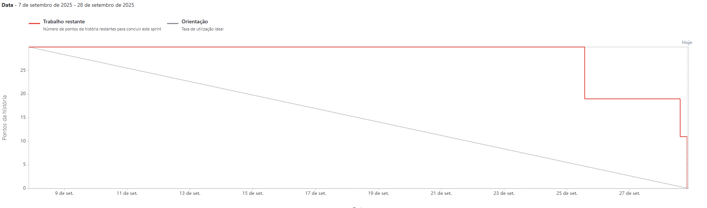

  

# ATHOS
### 5° Semestre Banco de Dados

  <a href ="#busts_in_silhouette-integrantes-da-equipe">  Integrantes </a> •
  <a href ="#pushpin-projeto-api">  Projeto API </a> •
  <a href="#white_check_mark-requisitos">  Requisitos </a> •
  <a href="#card_file_box-backlog-do-produto"> Backlog do Produto </a> •
  <a href="#calendar-backlog-das-sprints"> Backlog das Sprints </a> 
  <a href="#hourglass_flowing_sand-cronograma-da-api"> Cronograma </a>•
  <a href="#computer-tecnologias-utilizadas"> Tecnologias Utilizadas </a> •
  <a href="#gear-branch"> Estratégia de Branches e Padrão de Commit </a> • 
  <a href="#gear-documentacoes"> Documentações </a> •

<h1 align="center" id="busts_in_silhouette-integrantes-da-equipe">Integrantes da Equipe</h1>

 
 

| Integrantes | Redes Sociais |
|-------------|---------------|
| Ruth Mira - Product Owner |   |
| Carla Daiane - Scrum Master |   |
| Caique - Developer |   |
| Juan  - Developer |   |
| Mateus Soares  - Developer |   |
| Rafael Trevizoli - Developer |   |
| Renato Mendes - Developer |   |

 

<h1 id="pushpin-projeto-api">📌 Projeto API</h1> 

### **Desafio**

O desafio consiste em desenvolver uma ferramenta analítica para gestão de projetos. A ferramenta deve consumir dados de um sistema de gestão via API, consolidar essas informações em um **Data Warehouse** e, a partir daí, gerar indicadores, dashboards e boards que permitam acompanhar o andamento dos projetos. A aplicação deve oferecer diferentes perfis de usuário, com níveis de permissão distintos.

  
### **Solução (ATHOS INSIGHT)**

O ATHOS INSIGHT será uma ferramenta que irá consumir dados diretamente de um sistema de gestão de projetos. Esses dados serão organizados em um **Data Warehouse**, que servirá como base para a criação de relatórios, dashboards e indicadores de desempenho. A plataforma permitirá que a equipe de gestão acompanhe o cronograma, os custos e a resolução de bugs, facilitando a tomada de decisões estratégicas e garantindo que os projetos sejam concluídos dentro do prazo e do orçamento. O sistema contará com diferentes níveis de acesso, assegurando a segurança e a privacidade das informações.

 

<h1 id="white_check_mark-requisitos">✅ Requisitos</h1> 

  
⚙️ Requisitos Funcionais

| ID | Requisito |
| :--- | :--- |
| **RF01** |  O sistema deve estabelecer e manter uma conexão contínua com a API oficial do Jira Cloud. Essa integração é fundamental para a coleta recorrente de dados, incluindo informações de projetos, módulos, atividades, status e o tempo registrado nas tarefas. Para garantir a segurança e a autenticação da comunicação, o sistema deve utilizar tokens de acesso. A principal função dessa integração é alimentar o banco de dados da aplicação de forma automatizada, normalizando os dados brutos recebidos da API para que possam ser utilizados nos relatórios e dashboards. Em caso de qualquer falha na comunicação ou indisponibilidade da API do Jira, a aplicação não deve parar de funcionar; ela irá operar com os dados mais recentes já armazenados e tratados no banco de dados, mantendo a continuidade das operações.|
| **RF02** | Na ausência de acesso à API do Jira, o sistema deverá dispor de um mecanismo de contingência que permita a utilização de documentos externos, nos formatos PDF e CSV, fornecidos pelo cliente. Esses documentos serão processados por scripts desenvolvidos pela equipe técnica e carregados no banco de dados da aplicação, possibilitando a geração de relatórios e dashboards com dados mokados. Essa abordagem garante que a aplicação continue a entregar valor e disponibilizar informações relevantes, mesmo antes da efetiva integração com a API oficial do Jira. Assim que o acesso à API for estabelecido, os dados passarão a ser obtidos diretamente da fonte oficial, substituindo o uso dos documentos externos. |
| **RF03** | O sistema foi projetado para ser uma solução de análise de longo prazo. Ele deve armazenar e permitir a visualização de dados históricos por períodos superiores a um ano. A interface do usuário precisa oferecer filtros flexíveis e variáveis, permitindo que o usuário visualize os dados de acordo com diferentes granularidades de tempo, como mês, ano ou todo o histórico do projeto, facilitando análises comparativas e a identificação de tendências ao longo do tempo. |
| **RF04** | O sistema deve incluir um módulo de gestão de usuários completo, que permita a criação, edição e exclusão de perfis. Serão definidos três perfis distintos com permissões claramente segregadas: Gerente de Projetos, Líder de Equipe e Membro da Equipe. As permissões de acesso e visualização de funcionalidades e dados devem ser rigidamente controladas por esses perfis, garantindo que cada usuário só possa acessar as informações e executar as ações para as quais está autorizado. Por exemplo, informações de custo por projeto só serão visíveis ao perfil de Gerente de Projetos.|
| **RF05** | O sistema deve ter a capacidade de gerar relatórios detalhados. Esses relatórios precisam fornecer insights precisos e acionáveis, baseados nos dados históricos. As informações contidas neles devem incluir a Produtividade diária e mensal, um Consolidado de horas por projeto e um Comparativo entre as horas previstas e as horas realizadas. A qualidade e a precisão desses relatórios são essenciais para a tomada de decisões gerenciais. |
| **RF06** | Para atender a diferentes necessidades de análise, o sistema deve permitir a geração de relatórios tanto por projeto individual quanto de forma consolidada para múltiplos projetos. Essa flexibilidade é crucial para que os usuários possam ter uma visão geral ou aprofundada, dependendo do contexto da sua análise.|
| **RF07** | O sistema deve disponibilizar um relatório visual em formato de calendário que exibe as horas lançadas diariamente por cada desenvolvedor de uma equipe específica. Para a soma total de horas, os dias com status de Folga (FO), Férias (FÉ) ou Licença (LI) devem ser contabilizados como 0. Caso um dia não tenha horas lançadas mas tenha um dos status, o campo deverá exibir a sigla correspondente (ex: FO, FÉ, LI) em vez de um valor numérico. |
| **RF08** | O sistema deve consolidar e apresentar relatórios mensais que detalham as horas de trabalho totais de cada colaborador e projeto. Esses relatórios devem incluir tabelas e gráficos comparativos, permitindo uma análise visual e rápida da distribuição de horas ao longo do mês. O relatório também deve permitir a exportação em formato PDF.|
| **RF09** | Para uma análise de desempenho de longo prazo, o sistema deve gerar relatórios anuais que comparem as horas previstas com as horas realizadas por colaborador, discriminadas mês a mês. Esses relatórios devem ser enriquecidos com tabelas, gráficos de barras e valores consolidados, facilitando a identificação de desvios e o monitoramento da performance anual da equipe. |
| **RF10** | O sistema deve apresentar um Dashboard de Custos para gerentes de projeto, permitindo a visualização e o controle da evolução orçamentária. O dashboard deve exibir cartões de resumo com os valores de Orçamento Previsto (ajustável pelo gerente), Custo Realizado (baseado em horas do Jira e custos manuais), Saldo Remanescente e a porcentagem do orçamento utilizada. Um gráfico de barras deve detalhar os custos por desenvolvedor. A ferramenta deve permitir a aplicação de filtros por projeto, além de oferecer a exportação do dashboard em PDF. Todos os dados históricos de projetos ativos e concluídos devem ser armazenados e exibidos. O acesso é exclusivo para o perfil de Gerente de Projetos. |
| **RF11** |  Todos os dashboards e relatórios gerados pelo sistema devem estar disponíveis para exportação no formato PDF. O arquivo gerado deve ter um layout limpo, padronizado e organizado, garantindo que todas as informações visíveis na tela sejam apresentadas de forma clara e profissional no documento final. |
| **RF12** | O sistema deve apresentar um Dashboard de Issues Abertas que permite aos gerentes de projeto monitorar o fluxo de trabalho da equipe. O painel deve incluir um gráfico de pizza com a quantidade de issues por status (Não Iniciado, Em Progresso, MR e Concluído), um card de resumo com o custo médio das issues em aberto e uma tabela detalhada que liste o custo associado a cada issue por desenvolvedor. Os dados serão obtidos diretamente do Jira. O dashboard deve ser exportável para PDF e ter acesso restrito a gerentes de projeto. É obrigatório que haja filtros por projeto. |
| **RF13** |  Para avaliar a qualidade do software e o impacto financeiro dos bugs, o sistema deve incluir um Dashboard de Bugs exclusivo para gerentes de projeto. Este painel deve exibir um gráfico de pizza com a quantidade de bugs em cada status (Não Iniciado, Em Progresso, MR e Concluído). Ele também deve apresentar um card de resumo com o custo médio dos bugs em aberto e uma tabela detalhada que mostra o custo de cada bug por desenvolvedor. Os dados serão extraídos do Jira. O dashboard deve ser exportável para PDF e deve ser possível aplicar filtros por projeto. |
| **RF14** | O sistema deve oferecer um dashboard de horas por atividade que permita aos gerentes de projeto acompanhar o esforço investido em cada tarefa. O painel deve consolidar as horas gastas em cada atividade e exibir essa distribuição em um gráfico de barras. Para uma análise granular, deve ser possível aplicar filtros por projeto, sprint e colaborador. O dashboard completo deve ser exportável para PDF. |
| **RF15** |Para entender onde o esforço da equipe está concentrado, o sistema deve fornecer um dashboard de horas por módulo (também conhecido como Epic, produto ou entregável). Este painel deve consolidar as horas utilizadas por módulo e apresentar um comparativo em tabela e gráfico. O usuário deve ter a capacidade de aplicar filtros por período e por projeto. O dashboard completo, com seus dados e gráficos, deve ser exportável para PDF. |
| **RF16** | O sistema deve ter um dashboard de horas por desenvolvedor que ajude a avaliar a produtividade individual e a detectar sobrecargas. Este painel deve exibir as horas lançadas por cada desenvolvedor, discriminadas por atividade, módulo e dia. Para uma análise detalhada, o usuário deve poder filtrar por período e por projeto. O dashboard deve apresentar gráficos comparativos, como gráficos de linha para a evolução diária e gráficos de barras para a distribuição por módulo. O painel deve ser exportável para PDF. |

  
⚙️ Requisitos Não Funcionais

| ID | Requisito |
| :--- | :--- |
| **RNF01** | A arquitetura da aplicação deve ser altamente escalável para suportar o crescimento da base de usuários, projetado para ir de 15 para 2.000 usuários em 12 meses e, posteriormente, para 10.000 em 18 meses. A aplicação não deve sofrer degradação de performance perceptível com o aumento de carga. O tempo de processamento e exibição de relatórios e dashboards deve ser de rápido para consultas de até um ano de dados. |
| **RNF02** | A aplicação deve ser desenvolvida em Python utilizando o framework Django.Disponibilidade: O sistema deve ter uma disponibilidade de 99% do tempo mensal, excluindo apenas as janelas de manutenção programada. Isso garante que a ferramenta esteja sempre acessível e pronta para uso pelos clientes. |
| **RNF03** | A aplicação será desenvolvida em Python utilizando o framework Django. A arquitetura subjacente deve ser flexível e robusta, permitindo a inclusão de novos endpoints da API do Jira sem a necessidade de grandes refatorações no código-base, facilitando futuras expansões. |
| **RNF04** | As interfaces da aplicação devem ser intuitivas e de fácil uso, proporcionando uma experiência fluida para todos os perfis de usuário. O design deve ser totalmente responsivo, adaptando-se perfeitamente a diferentes tamanhos de tela, de desktops a dispositivos móveis, garantindo a usabilidade em qualquer ambiente. |
| **RNF05** | O sistema deve implementar autenticação baseada em tokens para o acesso de usuários, garantindo que apenas pessoas autorizadas possam utilizar a plataforma. Todos os dados sensíveis, como senhas e informações de autenticação, devem ser criptografados para assegurar a proteção e a confidencialidade das informações.  |

 

<h1 id="card_file_box-backlog-do-produto">🗂 Backlog do Produto</h1> 

| Rank | Prioridade | User Story | Estimativa (horas) | Sprint |
| :--- | :--- | :--- | :--- | :--- |
| **1.1** | Alta | Como Gerente de Projetos, quero visualizar um relatório detalhado das horas lançadas diariamente por cada desenvolvedor, para que eu possa acompanhar a produtividade da equipe e identificar a distribuição do tempo ao longo do mês. | 8 | 1 |
| **1.2** | Alta | Como Gerente de Projetos, quero visualizar um relatório mensal consolidado de horas por projeto e por colaborador, para que eu possa entender como o tempo da equipe foi distribuído entre os diferentes projetos. | 11 | 1 |
| **1.3** | Alta | Como Gerente de projetos, quero visualizar um relatório anual que compara as horas previstas com as horas realizadas por cada colaborador, para que eu possa acompanhar o desempenho da equipe ao longo do ano e verificar se as expectativas estão sendo cumpridas. | 11 | 1 |
| **2.1** | Alta | Como Administrador, quero que o sistema se integre ao Jira, realizando requisições às suas APIs, para que os dados sejam normalizados e salvos no banco de dados da aplicação, permitindo a geração de relatórios consistentes e atualizados. | | 2 |
| **3.1** | Média | Como Gerente de Projetos, quero visualizar a evolução dos custos previstos versus realizados em um dashboard interativo, com indicadores financeiros rápidos e dados de custo por desenvolvedor, para que eu possa controlar o orçamento do projeto de forma eficiente e tomar decisões baseadas em dados, inclusive podendo ajustar os valores de orçamento e custo/hora conforme a necessidade do projeto. | | 2 |
| **3.2** | Média | Como Gerente de Projetos, quero visualizar a quantidade de issues abertas classificadas por status (Não iniciado, Em progresso, MR e Concluído), além da distribuição de custos por desenvolvedor, para que eu possa monitorar a evolução do fluxo de trabalho da equipe e entender os custos associados a cada issue. | | 2 |
| **3.3** | Média | Como Gerente de Projetos, quero visualizar a quantidade de bugs reportados, abertos e corrigidos, além da distribuição de custos por desenvolvedor,  para que eu possa avaliar a qualidade do software, identificar áreas críticas e analisar o impacto financeiro dos bugs. | | 2 |
| **4.1** | Baixa | Como Gerente de Projetos, quero visualizar a quantidade de horas utilizadas em cada atividade, para acompanhar o esforço investido e avaliar a eficiência da execução. | | 3 |
| **4.2** | Baixa | Como Gerente de Projetos, quero visualizar as horas utilizadas por módulo (Epic, produto ou entregável), para entender onde a equipe tem concentrado maior esforço. | | 3 |
| **4.3** | Baixa | Como Gerente de Projetos, quero visualizar as horas utilizadas por cada desenvolvedor, discriminadas por atividade, módulo e dia, para avaliar produtividade individual e detectar sobrecargas. | | 3 |
| **5.1** | Baixa | Como Gerente de Projetos, quero cadastrar novos usuários no sistema, para que eles tenham acesso de acordo com seu perfil (Gerente, Líder ou Membro). Essa funcionalidade deve permitir que eu crie, edite, visualize e exclua usuários sempre que necessário, garantindo que cada pessoa tenha o nível de acesso adequado para suas responsabilidades. | | 3 |

 

<h1 id="calendar-backlog-das-sprints">📅 Backlog das Sprints</h1> 

  
<b>Sprint 1</b>

  ### **Sprint 1: Planejamento e Execução**

* **Capacidade Estimada da Equipe por Sprint:** 30 Story Points
* **Meta da Sprint:** Entregar as User Stories de alta prioridade (Rank 1.1 + 1.2), totalizando 19 Story Points.
* **Previsão da Sprint (Extras, sem compromisso de entrega):** A User Storie de prioridade alta (Rank 1.3), que possui 11 Story Points, pode ser iniciada se houver capacidade extra na equipe após a conclusão da meta principal.

| Rank | Prioridade | User Story | Estimativa | Sprint |
| :--- | :--- | :--- | :--- | :--- |
| **1.1** | Highest | Como Gerente de projetos, quero visualizar um relatório detalhado das horas lançadas diariamente por cada desenvolvedor, para que eu possa acompanhar a produtividade da equipe e identificar a distribuição do tempo ao longo do mês. | 8 | 1 |
| **1.2** | High | Como Gerente de projetos, quero visualizar um relatório mensal consolidado de horas por projeto e por colaborador, para que eu possa entender como o tempo da equipe foi distribuído entre os diferentes projetos. | 11 | 1 |
| **1.3** | Medium | Como Gerente de projetos, quero visualizar um relatório anual que compara as horas previstas com as horas realizadas por cada colaborador, para que eu possa acompanhar o desempenho da equipe ao longo do ano e verificar se as expectativas estão sendo cumpridas. | 11 | 1 |

### Vídeo da aplicação e suas funcionalidades:

[Assista pelo Youtube](https://www.youtube.com/watch?v=hKPVk8CMkfk).

Visualizar o [Wireframe da Sprint 1](https://www.figma.com/design/Vl267rAh8vitOhQZJw7Q2E/Athos?m=auto&t=El9wdyIkSuK8itIh-6)

Visualizar o [Modelo Físico da Sprint 1](img/bancov1.svg)

### **Definition of Ready (DoR)**

Um item de backlog está pronto para a sprint se:

* Possui título, descrição e objetivo claros.
* Critérios de aceitação e regras de negócio definidos.
* Prioridade estabelecida.
* Esforço estimado pela equipe.
* Dados/acessos disponíveis ou plano alternativo.
* Perfis de usuário e permissões especificados.
* Estratégia de testes definida.
* Artefatos de apoio (wireframes, mockups, diagramas) fornecidos.

### **Definition of Done (DoD)**

Um item de backlog é considerado "concluído" (Done) se:

* O código foi escrito, testado localmente e está limpo (padrões do time).
* Revisado e aprovado por pares.
* Integrado à branch principal (release).
* Todos os testes automatizados foram criados e passaram.
* Critérios de aceitação da User Story foram atendidos.
* O Product Owner aprovou a funcionalidade.

  
<b>Sprint 2</b>

### **Sprint 2: Planejamento e Execução**

* **Capacidade Estimada da Equipe por Sprint:**  Story Points  
* **Meta da Sprint:** Entregar User Story de Alta Proridade (Rank 2.1) e iniciar a entrega das User Stories de Média prioridade (Rank 3.1 + Rank 3.2), totalizando  Story Points. 
* **Previsão da Sprint (Extras, sem compromisso de entrega):** User Story 3.3 podem ser iniciadas se houver capacidade extra.  

| Rank | Prioridade | User Story | Estimativa | Sprint |
| :--- | :--- | :--- | :--- | :--- |
| **2.1** | Alta | Como administrador, quero que o sistema se integre ao Jira, realizando requisições às suas APIs, para que os dados sejam normalizados e salvos no banco de dados da aplicação, permitindo a geração de relatórios consistentes e atualizados. | | 2 |
| **3.1** | Média | Como gerente de projetos, quero visualizar a evolução dos custos previstos versus realizados em um dashboard interativo, com indicadores financeiros rápidos e dados de custo por desenvolvedor, para que eu possa controlar o orçamento do projeto de forma eficiente e tomar decisões baseadas em dados, inclusive podendo ajustar os valores de orçamento e custo/hora conforme a necessidade do projeto. |  | 2 |
| **3.2** | Média | Como gerente de projetos, quero visualizar a quantidade de issues abertas classificadas por status (Não iniciado, Em progresso, MR e Concluído), além da distribuição de custos por desenvolvedor, para que eu possa monitorar a evolução do fluxo de trabalho da equipe e entender os custos associados a cada issue. |  | 2 |
| **3.3** | Média | Como gerente de projetos, quero visualizar a quantidade de bugs reportados, abertos e corrigidos, além da distribuição de custos por desenvolvedor, para que eu possa avaliar a qualidade do software, identificar áreas críticas e analisar o impacto financeiro dos bugs. | | 2 |

### Vídeo da aplicação e suas funcionalidades:

[Assista pelo Youtube](https://youtu.be/) ou pelo seu [Reprodutor de Vídeos](/img/)

Visualizar o [Wireframe da Sprint 2](https://www.figma.com/design/Vl267rAh8vitOhQZJw7Q2E/Athos?m=auto&t=El9wdyIkSuK8itIh-6)

Visualizar o [Modelo Físico da Sprint 2](/img/)

### **Definition of Ready (DoR)**

Um item de backlog está pronto para a sprint se:

* Possui título, descrição e objetivo claros.
* Critérios de aceitação e regras de negócio definidos.
* Prioridade estabelecida.
* Esforço estimado pela equipe.
* Dados/acessos disponíveis ou plano alternativo.
* Perfis de usuário e permissões especificados.
* Artefatos de apoio (wireframes, mockups, diagramas) fornecidos.

### **Definition of Done (DoD)**

Um item de backlog é considerado "concluído" (Done) se:

* O código foi escrito, testado localmente e está limpo (padrões do time).  
* A documentação técnica foi atualizada pelos dev.  
* Integrado à branch principal (develop).  
* Todos os testes automatizados foram criados e passaram.  
* Critérios de aceitação da User Story foram atendidos.  
* A aplicação está organizada e responsiva, garantindo boa experiência.  
* A interface atende aos princípios de usabilidade, com navegação clara e consistente para o usuário final.  
* Os elementos visuais seguem o padrão definido pelo time (design system ou guia de estilo).  

  
<b>Sprint 3</b>

### **Sprint 3: Planejamento e Execução**

* **Capacidade Estimada da Equipe por Sprint:** [Capacidade Estimada da Equipe]
* **Meta da Sprint:** [Descreva a meta da Sprint 3]
* **Previsão da Sprint (Extras, sem compromisso de entrega):** [Descreva as tarefas extras para a Sprint 3]

| Rank | Prioridade | User Story | Estimativa | Sprint |
| :--- | :--- | :--- | :--- | :--- |
| | | | | |
| | | | | |

### Vídeo da aplicação e suas funcionalidades:

[Assista pelo Youtube](https://youtu.be/) ou pelo seu [Reprodutor de Vídeos](/img/)

Visualizar o [Wireframe da Sprint 3](/img/)

Visualizar o [Modelo Físico da Sprint 3](/img/)

<h1 id="hourglass_flowing_sand-cronograma-da-api"> 📊Burndown </h1>

  
<strong>Sprint 1</strong>

  

  
<strong>Sprint 2</strong>

  
<strong>Sprint 3</strong>

 

<h1 id="hourglass_flowing_sand-cronograma-da-api"> ⏳ Cronograma da API </h1>

- [x] 25/08 a 29/08 - Kick-off
- [x] 08/09 a 28/09 - Primeira Sprint
- [ ] 29/09 a 03/10- Sprint Review / Planning
- [ ] 06/10 a 26/10 - Segunda Sprint
- [ ] 27/10 a 31/10 - Sprint Review / Planning
- [ ] 03/11 a 23/11 - Terceira Sprint
- [ ] 24/11 a 28/11 - Sprint Review 
- [ ] 04/12 - Feira de Soluções e Apresentação Final API

 

<h1 id="computer-tecnologias-utilizadas">💻Tecnologias Utilizadas </h1> 

 

<h1 id="gear-branch">🌿 Estratégia de Branches e Padrão de Commit</h1>

  
<b>Estratégia de Branches</b>

#### 1. Cada repositório (**Athos**, **Server** e **Docs**) segue a mesma lógica:

- **feature/\*** → Desenvolvimento de novas funcionalidades  
- **develop** → Integração contínua de features (ambiente de homologação)  
- **release** → Versão de entrega para produção. Sempre estável  
- **hotfix/\*** → Correções urgentes aplicadas diretamente na release  

📌 **Hierarquia (de cima para baixo):**  
- **release > develop > feature/*

#### 2. Submódulos no Athos
O repositório **Athos** possui como submódulos os repositórios **Server** e **Docs**.  

O Athos aponta sempre para o **HEAD** das branches correspondentes:
- Athos **release** ➡️ Submódulos **release**  
- Athos **develop** ➡️ Submódulos **develop**  

👉 Isso significa que **não é necessário atualizar manualmente o Athos** a cada merge nos submódulos.

#### 3. Fluxo de Trabalho no Server (exemplo prático)
Se está desenvolvendo no **Server**:

1. Criar uma **branch feature** a partir da **develop**  
2. Desenvolver a funcionalidade  
3. Atualizar a sua branch com a **develop** (para evitar conflitos)  
4. Abrir um **Pull Request (PR)** para a **develop**  
5. Acompanhar o processo de PR e, se necessário, atualizar sua branch com a **develop** (caso outros PRs sejam mergeados antes)  
6. Após **2 aprovações**, mergear o código na **develop**  

📌 **Obs.:** O mesmo fluxo vale para outros submódulos (ex: **Docs**).

#### 4. Releases
Os releases acontecem **ao fim de cada sprint**.  

📅 **Ciclo de release mensal:**
- **Semana 1:** Planning  
- **Semanas 2 a 4:** Sprint  
- **Fim da semana 4:** Release  

⚠️ **Importante:**  
- Se algo não estiver estável, **não deve subir** para a release.  
- Neste caso, faz-se um **release parcial** (somente o que está pronto) ou **atrasa-se o release**.  

#### 5. Hotfixes
- Criados a partir da **release** (não da develop).  
- Após aplicados, são mergeados:
  - Na própria **release** (correção imediata)  
  - Na **develop** (para manter sincronizado)  

#### 6. Benefícios da Estratégia

- Clareza no fluxo de integração (cada repo cuida do seu merge).
- Athos sempre sincronizado com o estado correto dos submódulos.
- Releases previsíveis e organizados.
- Hotfixes rápidos sem comprometer o fluxo principal.

  

  
<strong>Padrão de Commits e Branches</strong>

## 1. Padrão de Escrita de Commits
- Todo o conteúdo deve ser escrito em **letras minúsculas**, exceto os **IDs da Task**.
- Os **IDs** devem ser separados por espaço.

## 2. Boas Práticas de Commit
- Prefira realizar **commits pequenos e frequentes**, cada um rastreando a task correspondente.
- Evite concentrar várias tarefas em um único commit.
- Escreva a descrição em **português** para manter um padrão.

**Exemplo:**
git commit "ATHOS-1 feat(autenticação): adicionar endpoint de login"

| Tipo     | Descrição                                        | Exemplo                                                                         |
| -------- | ------------------------------------------------ | ------------------------------------------------------------------------------- |
| feat     | Novas funcionalidades                            | ATHOS-01 feat(autenticacao): adiciona endpoint de login                         |
| fix      | Correção de bugs                                 | ATHOS-01 fix(usuario): corrige upload da foto de perfil                         |
| chore    | Manutenção, sem impacto direto                   | ATHOS-01 chore(deps): atualiza dependências do projeto                          |
| docs     | Alterações na documentação                       | ATHOS-01 docs(readme): atualiza instruções de instalação                        |
| style    | Ajustes de formatação, sem alterar comportamento | ATHOS-01 style(css): corrige indentação no main.css                             |
| refactor | Refatoração de código                            | ATHOS-01 refactor(servico-usuario): remove verificações redundantes             |
| perf     | Melhorias de desempenho                          | ATHOS-01 perf(api): reduz tempo de resposta do endpoint de busca                |
| test     | Adição ou ajuste de testes                       | ATHOS-01 test(usuario): adiciona testes unitários                               |
| build    | Mudanças em build ou dependências externas       | ATHOS-01 build(docker): adiciona configuração Docker                            |
| ci       | Alterações em CI/CD                              | ATHOS-01 ci(workflow): atualiza workflow do GitHub Actions                      |
| revert   | Reverter um commit anterior                      | ATHOS-01 revert(auth): reverte "feat(auth): adiciona endpoint de login com JWT" |
| hotfix   | Correções urgentes em produção                   | ATHOS-01 hotfix(usuario): corrige falha ao registrar usuário                    |

## 4. Padrão de Branches
Feature Branch é criada a partir da branch principal para desenvolver uma nova funcionalidade ou melhoria.
Nome da branch: letras minúsculas, iniciando com o ID da Task em maiúsculas, separado por barra (/).
Descrição: palavras separadas por hífens (-), sem espaços.

Exemplo:
git checkout -b ATHOS-1/criar-tela-de-login

Fix Branch é criada a partir da branch principal para corrigir um bug ou erro no código.
Nome da branch: mesmo padrão da feature branch, mas com descrição do ajuste.

Exemplo:
git checkout -b ATHOS-1/correcao-do-modal-de-cadastro-de-usuario
git switch -c ATHOS-1/criar-tela-de-login

## 5. Por que seguimos esse padrão?

- Isolamento: alterações em feature ou fix branch ficam separadas da branch principal até estarem finalizadas e aprovadas, evitando impacto no código estável.
- Colaboração: permite que vários desenvolvedores trabalhem em diferentes funcionalidades e correções ao mesmo tempo, sem conflitos diretos.
- Controle de qualidade: cada mudança passa por revisão de código e testes antes de ser integrada à branch principal, preservando a estabilidade do projeto.

6. Pull Request

Após concluir a funcionalidade ou correção, abra uma Pull Request (PR) contendo todos os IDs envolvidos (Tasks) e uma descrição detalhada das implementações realizadas.
A solicitação pode ser feita pelo Jira ou pelo GitHub.

⚠️ Importante: cada tarefa deve ter sua própria Pull Request.

Exemplo:
- ATHOS-1 Atualiza as tabelas do banco

 

<h1 id="gear-documentacoes"> 📚  Documentações </h1>
   

  
Caso tenha dúvidas ou queira rodar o projeto, acesse a documentação tecnica completa em :

  

  

